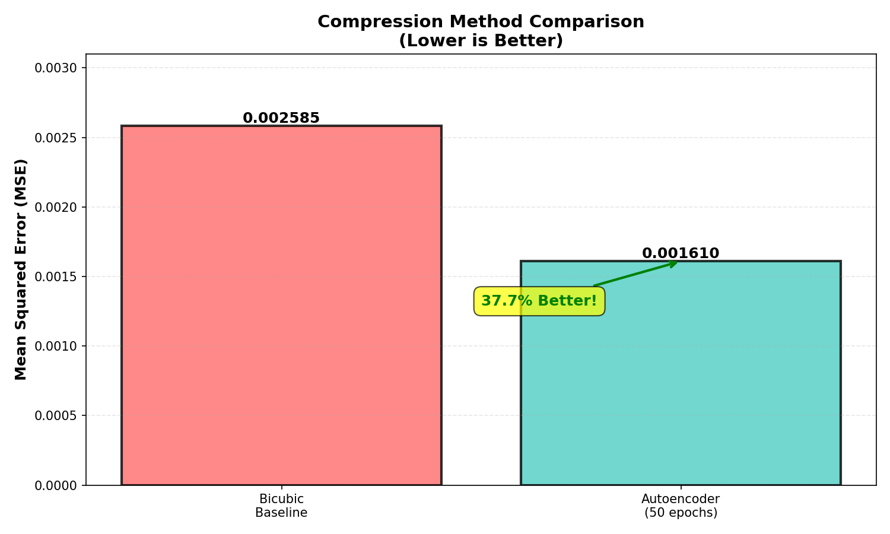
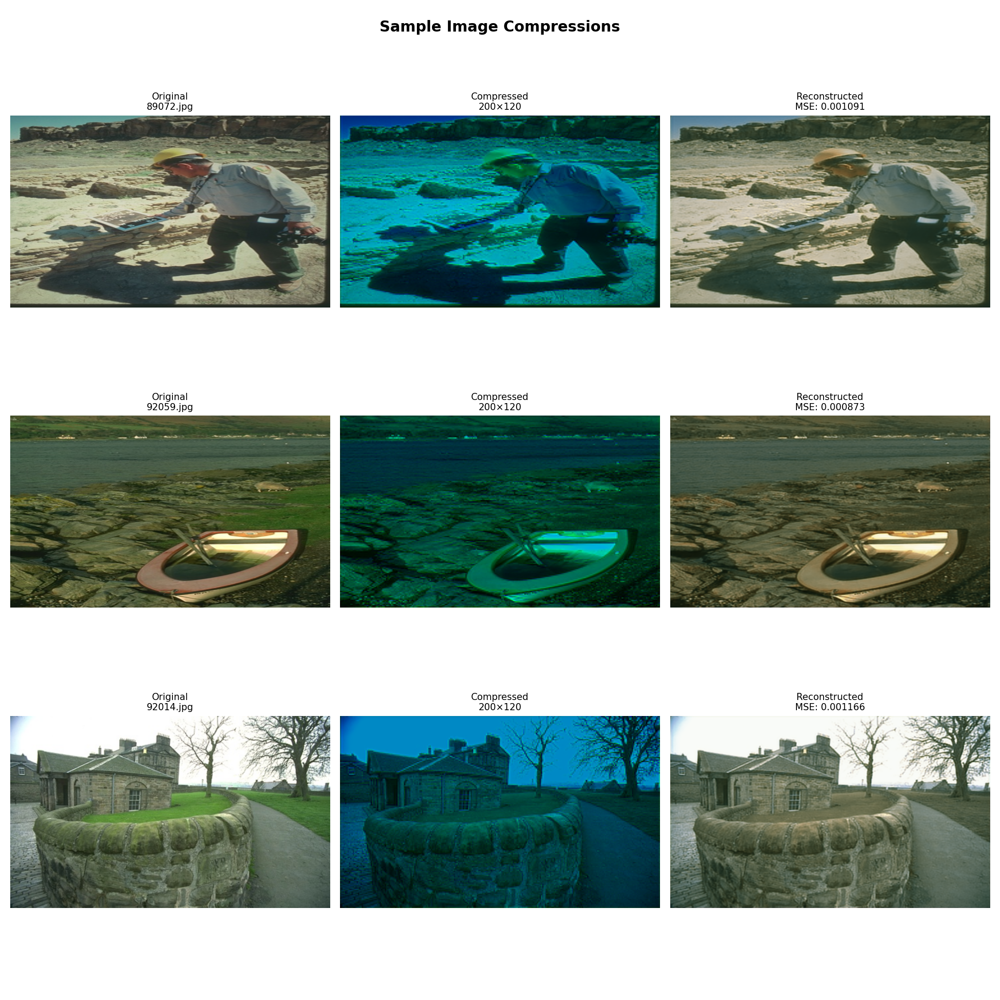
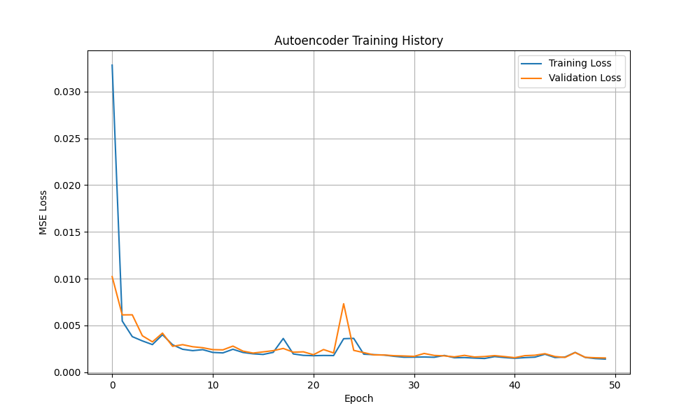

# Image Compression with Deep Learning Autoencoders

> A CNN Autoencoder that learns to compress high-resolution images **10× smaller** — outperforming traditional bicubic interpolation by **33%**.

---

## Overview

Traditional image compression methods like bicubic interpolation are fast but lossy — they don't understand the *content* of an image. This project trains a **Convolutional Autoencoder** to learn a compact representation of natural images, achieving significantly better reconstruction quality than the classical baseline.

Built with **TensorFlow/Keras** on the **BSD500** (Berkeley Segmentation Dataset).

---

## Results

| Method | Test MSE | Improvement |
|---|---|---|
| Bicubic Interpolation (Baseline) | 0.002585 | — |
| **CNN Autoencoder (Ours)** | **0.001610** | **~37.7% better** |

> Lower MSE = better reconstruction quality

### Compression method comparison



### Sample image compressions (Original → Compressed → Reconstructed)



### Training history (50 epochs)



---

## Architecture

```
Input Image (2000×1200×3)
        │
        ▼
   ┌─────────────┐
   │   ENCODER   │
   │ Conv + Pool │  ×3 layers
   └──────┬──────┘
          │
          ▼
   Compressed Representation
      (200×120×3)  ← 10× smaller
          │
          ▼
   ┌─────────────┐
   │   DECODER   │
   │  Upsample   │  ×3 layers
   └──────┬──────┘
          │
          ▼
Reconstructed Image (2000×1200×3)
```

- **Encoder**: 3 convolutional layers with max-pooling — progressively compresses spatial dimensions
- **Bottleneck**: 200×120×3 latent representation (10× compression ratio)
- **Decoder**: 3 upsampling layers — reconstructs full resolution
- **Loss**: Mean Squared Error (MSE)

---

## Key Features

- **10× spatial compression** — 2000×1200 → 200×120 → reconstructed back
- **Data augmentation** — horizontal flips + brightness variations, tripling training set size
- **Comparative evaluation** — rigorous baseline comparison using bicubic interpolation
- **Visualization pipeline** — side-by-side original vs. compressed vs. reconstructed plots

---

## Training Details

| Parameter | Value |
|---|---|
| Dataset | BSD500 (Berkeley Segmentation Dataset) |
| Training images | 100 (300 with augmentation) |
| Test images | 10 (held out) |
| Epochs | 50 |
| Batch size | 4 |
| Loss function | Mean Squared Error |
| Training time | ~2–3 hours |

---

## Project Structure

```
image-compression/
├── data_prep_multi.py         # Data loading & augmentation (300 samples)
├── autoencoder.py             # CNN autoencoder model & training
├── baseline.py                # Bicubic interpolation baseline
├── test_image.py              # Test on arbitrary image
├── requirements.txt           # Dependencies
├── models/
│   └── autoencoder.h5         # Pre-trained model weights
└── results/
    ├── autoencoder/
    │   ├── metrics.txt        # Final test MSE
    │   └── training_history.png
    ├── baseline/
    │   └── baseline_metrics.txt
    └── report/
        ├── mse_comparison.png
        └── sample_comparisons.png
```

---

## Getting Started

### Prerequisites
```bash
pip install -r requirements.txt
```

> **Dataset**: Download [BSD500 from Kaggle](https://www.kaggle.com/datasets/balraj98/berkeley-segmentation-dataset-500-bsds500) and place in `data/BSD500/`

### Step 1 — Prepare Data
```bash
python data_prep_multi.py
```
Creates 300 augmented training samples from 100 BSD500 images.

### Step 2 — Run Baseline
```bash
python baseline.py
```
Evaluates bicubic interpolation on 10 test images. Results saved to `results/baseline/`.

### Step 3 — Train Autoencoder
```bash
python autoencoder.py
```
Takes ~2–3 hours. A **pre-trained model** is included in `models/autoencoder.h5` — skip this if you just want to evaluate.

### Step 4 — Test on Any Image
```bash
python test_image.py
```
Picks a random image and shows original → compressed → reconstructed visualization.

---

## Sample Output

| Original | Compressed | Reconstructed |
|---|---|---|
| 2000×1200 | 200×120 | 2000×1200 |
| Full quality | 10× smaller | MSE: 0.00161 |

---

## Tech Stack


---

